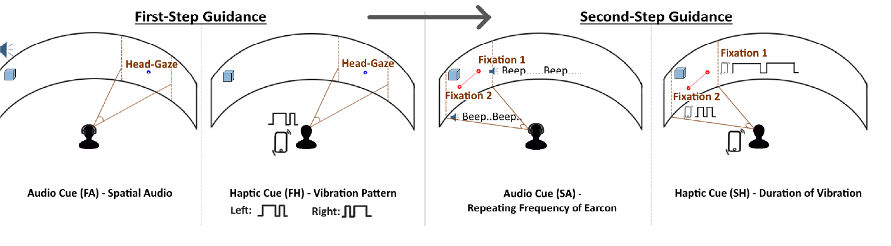
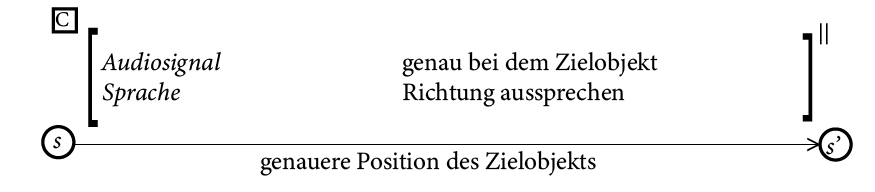

# Multimodale Mensch-Maschine-Interaktion

Bearbeiter: Kyrylo Kozhemiakin

## Quellen

### Two-Step Gaze Guidance

Die Studie zum "Two-Step Gaze Guidance-System" untersucht, wie die Kombination aus Audio- und haptischen Signalen die Effizienz bei Suchaufgaben steigern kann. In einem zweistufigen Ansatz werden Nutzer zunächst durch räumliches Audio oder Vibrationen grob in die richtige Richtung gelenkt. Danach führt eine feinere Orientierung mithilfe von präziseren Audio- oder haptischen Signalen zum Ziel. In einer Laborstudie mit 69 Teilnehmern erwies sich die Nutzung von räumlichem Audio in der ersten Stufe als besonders effektiv und wurde von den Nutzern als intuitiver und hilfreicher wahrgenommen als das haptische Feedback. Als Fazit der Studie kann man sagen, dass räumliches Audio  deutliche Vorteile bei der Blickführung bietet und wird daher als bevorzugtes Mittel in der ersten Stufe empfohlen, da es die Zielsuche beschleunigt und die Benutzerfreundlichkeit erhöht.

### GlassBoARd: A Gaze-Enabled AR Interface for Collaborative Work

Das Dokument beschreibt "GlassBoARd", ein AR-System für kollaborative Arbeit, das Blickverfolgung nutzt, um räumlich getrennte Benutzer in Echtzeit interagieren zu lassen. Über Avatare können Benutzer Blickkontakt herstellen und nonverbale Hinweise austauschen, was die Kommunikation verbessert. In drei Entwicklungsstufen wurde das System optimiert und getestet. Ziel ist, die Wirkung von Blickdaten auf Zusammenarbeit und Kommunikationsqualität weiter zu erforschen.

## Erweiterung und Variation

| | Two-Step Gaze Guiadance | GlassBoARd: A Gaze-Enabled AR Interface for Collaborative Work |
| --- | ---- | --- |
| _Audiosignal_ | genau bei dem Zielobject | infromiert über den hergestellten Blickkontakt
| _Vibration_ | auf der rechten oder linken Seite | wenn der Nutzer vom vorgesehenen Arbeitsablauf abweicht
| _Sprache_ | kann mit Hilfe von Schlagwörtern den Nutzer in die allgemeine Richtung des Ziels lenken | um verbale Anweisungen und Informationen auszutauschen

## Literaturverzeichnis

Tiffany C.K. Kwok, Peter Kiefer, and Martin Raubal. 2022. Two-Step Gaze Guidance. In Proceedings of 
the 2022 International Conference on Multimodal Interaction (ICMI '22). Association for Computing 
Machinery, New York, NY, USA, 299–309.
https://doi.org/10.1145/3536221.3556612

Kenan Bektaş, Adrian Pandjaitan, Jannis Strecker, and Simon Mayer. 2024. GlassBoARd: A Gaze-Enabled AR Interface for Collaborative Work. In Extended Abstracts of the CHI Conference on Human Factors in Computing Systems (CHI EA '24). Association for Computing Machinery, New York, NY, USA, Article 181, 1–8. 
https://doi.org/10.1145/3613905.3650965
