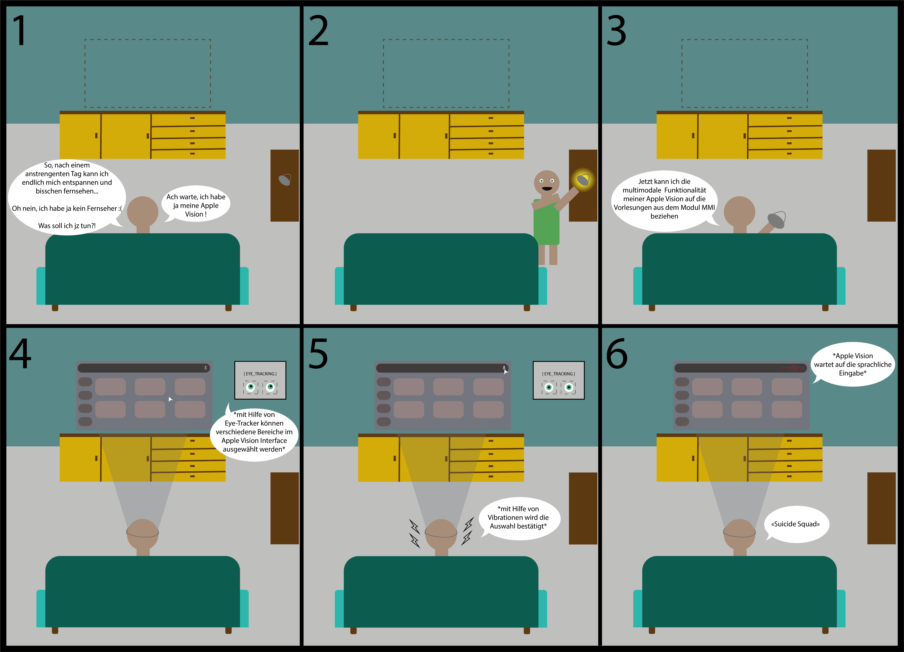

# Multimodale Mensch-Maschine-Interaktion

Bearbeiter: Kyrylo Kozhemiakin

## Quellen

### Two-Step Gaze Guidance

Die Studie zum "Two-Step Gaze Guidance-System" untersucht, wie die Kombination aus Audio- und haptischen Signalen die Effizienz bei Suchaufgaben steigern kann. In einem zweistufigen Ansatz werden Nutzer zunächst durch räumliches Audio oder Vibrationen grob in die richtige Richtung gelenkt. Danach führt eine feinere Orientierung mithilfe von präziseren Audio- oder haptischen Signalen zum Ziel. In einer Laborstudie mit 69 Teilnehmern erwies sich die Nutzung von räumlichem Audio in der ersten Stufe als besonders effektiv und wurde von den Nutzern als intuitiver und hilfreicher wahrgenommen als das haptische Feedback. Als Fazit der Studie kann man sagen, dass räumliches Audio  deutliche Vorteile bei der Blickführung bietet und wird daher als bevorzugtes Mittel in der ersten Stufe empfohlen, da es die Zielsuche beschleunigt und die Benutzerfreundlichkeit erhöht.

### GlassBoARd: A Gaze-Enabled AR Interface for Collaborative Work

Das Paper stellt GlassBoARd vor, ein AR-System, das Blickverfolgung und Avatare nutzt, um virtuelle Zusammenarbeit zu verbessern. Eine transparente Oberfläche ermöglicht natürlichen Blickkontakt, da die Augenbewegungen der Avatare den Nutzern entsprechen. Nach drei Entwicklungsstufen, in denen Funktionalität und Benutzerfreundlichkeit optimiert wurden, wurde das System erfolgreich in Tests eingesetzt. Es reduziert verbalen Aufwand und stärkt nonverbale Kommunikation. Zukünftig soll GlassBoARd vollständig AR-basiert werden, um Präsenz und Effizienz in realen Arbeitsprozessen weiter zu verbessern.

![Das Dokument beschreibt "GlassBoARd", ein AR-System für kollaborative Arbeit, das Blickverfolgung nutzt, um räumlich getrennte Benutzer in Echtzeit interagieren zu lassen. Über Avatare können Benutzer Blickkontakt herstellen und nonverbale Hinweise austauschen, was die Kommunikation verbessert. In drei Entwicklungsstufen wurde das System optimiert und getestet. Ziel ist, die Wirkung von Blickdaten auf Zusammenarbeit und Kommunikationsqualität weiter zu erforschen.}

## Erweiterung und Variation

| | Two-Step Gaze Guiadance | GlassBoARd: A Gaze-Enabled AR Interface for Collaborative Work |
| --- | ---- | --- |
| Audiosignal | genau bei dem Zielobject | infromiert über den hergestellten Blickkontakt
| Vibration | auf der rechten oder linken Seite | _wenn der Nutzer vom vorgesehenen Arbeitsablauf abweicht_
| _Sprache_ | _kann mit Hilfe von Schlagwörtern den Nutzer in die allgemeine Richtung des Ziels lenken_ | _um verbale Anweisungen von dem Nutzer _

## Storytelling for Design

### CROW-Framework

| Dimension    | Description |
| ------------ | ----------- |
| Character    | möchte sich nach dem anstrengenten Tag auf der Arbeit entspannen, technikaffiner Nutzer, komfortable Nutzung des Internets und der Unterhaltungssystemen, Ersetzung des Fernsehers, ist ein überdurchnittlicher IOS-Nutzer, hat noch nie Erfahrung mit solchen Technologoen gemacht, findet hilfreich wenn man Feedback mit Hilfe von Vibrationen bekommt, empfindet die Varwaltung der Nutzeroberflächen mit Hilfe von Eye-Tracker atemberaubend und inovativ, auch die Möglichkeit, sprachliche Suche auszuführen, macht die Nutzung des Geräts praktisch und universal    |
| Relationship | die Interaktion zwischen Mensch und Gerät zeigt sich in der reibungslosen Nutzung der verschiedenen Funktionen von dem Gerät (Apple Vision). Mithilfe von Eye-Tracking wählt der Nutzer gewünschte Bereiche in der Benutzeroberfläche aus, wobei haptisches Feedback durch Vibrationen die Eingabe bestätigt. Zusätzlich wird die Bedienung durch Sprachsteuerung ergänzt, die eine präzise und benutzerfreundliche Steuerung ermöglicht. Diese Art der Interaktion verdeutlicht, wie sehr sich der Nutzer auf die Effizienz und Funktionalität der Technologie verlässt      |
| Objective    | das Hauptziel des Nutzers ist es, sich zu entspannen und einen Film zu genießen, obwohl er keinen Fernseher besitzt. Apple Vision bietet ihm genau diese Möglichkeit, indem es ein projiziertes Display nutzt und eine einfache Steuerung bereitstellt, die den Prozess komfortabel gestaltet       |
| Where        | der Nutzer befindet sich in einem schlichten, privat eingerichteten Wohnzimmer, das ihm eine ruhige Umgebung bietet. In dieser entspannten Atmosphäre kann er die Funktionen des Geräts ungestört nutzen       |

### Storyboarding

## Literaturverzeichnis

Tiffany C.K. Kwok, Peter Kiefer, and Martin Raubal. 2022. Two-Step Gaze Guidance. In Proceedings of 
the 2022 International Conference on Multimodal Interaction (ICMI '22). Association for Computing 
Machinery, New York, NY, USA, 299–309.
https://doi.org/10.1145/3536221.3556612

Kenan Bektaş, Adrian Pandjaitan, Jannis Strecker, and Simon Mayer. 2024. GlassBoARd: A Gaze-Enabled AR Interface for Collaborative Work. In Extended Abstracts of the CHI Conference on Human Factors in Computing Systems (CHI EA '24). Association for Computing Machinery, New York, NY, USA, Article 181, 1–8. 
https://doi.org/10.1145/3613905.3650965

